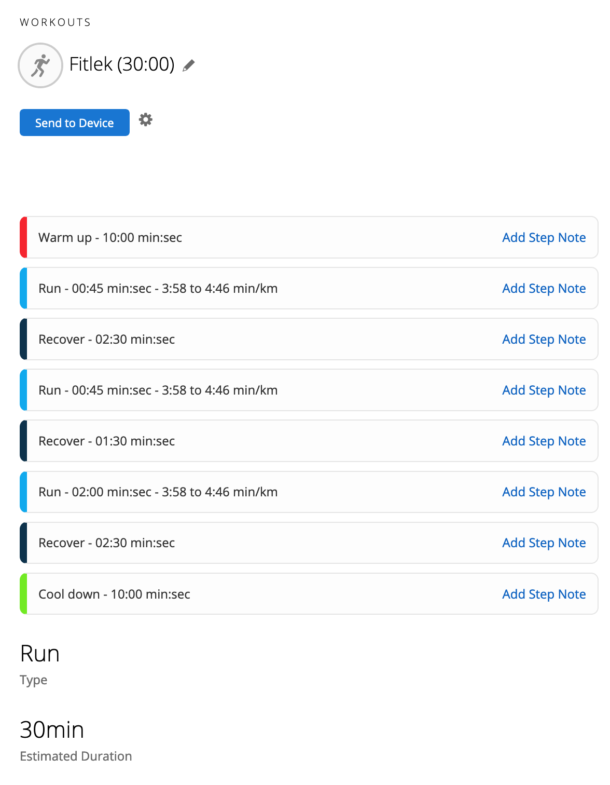

`fitlek` adds a randomised Fartlek workout to Garmin Connect for you.

It's called `FITlek` because the original intention was to create a `.fit` file that you could upload directly to your watch. That might still happen but going directly to Garmin is working for me right now..

---

If you just want to give this a go, check out [Run Randomly](https://runrandomly.com)! That's a hosted version of this script with support for downloading FIT files and syncing to [Intervals](https://intervals.icu).

---


### Usage

The easiest way to create a new workout for yourself if to clone the repo and run the script. There are no requirements other than a modern version of Python 3 (tested with 3.8).

```
> git clone https://github.com/sesh/fitlek.git
> cd fitlek
> python3 fitlek.py --duration=30:00 --target-pace=04:00 --username="your-garmin-connect-username" --password="your-garmin-connect-password"
```

Running the above should result in a new workout that looks something like this:




### Acknowledgements

- The login to Garmin Connect is heavily copied from [petergardfjall/garminexport](https://github.com/petergardfjall/garminexport). There's lots of great work in that project, definitely worth checking out if you're interested in working with Garmin Connect.
- Some details about the Workouts format were taken from [mgifos/quick-plan](https://github.com/mgifos/quick-plan/). If I'm inspired to work on this project more I expect it to start looking more like `quick-plan`.
